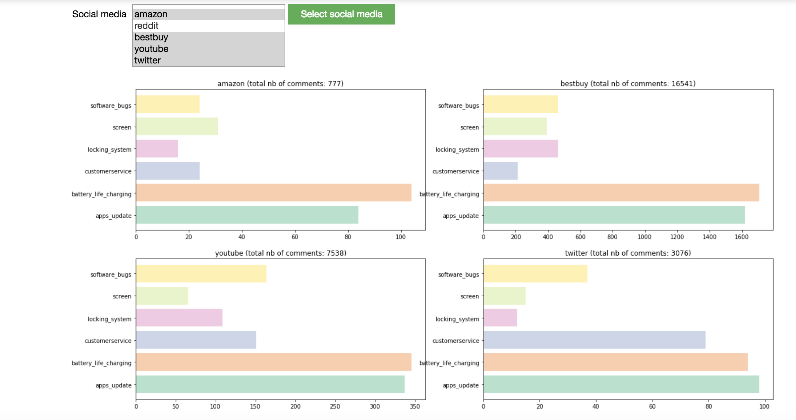
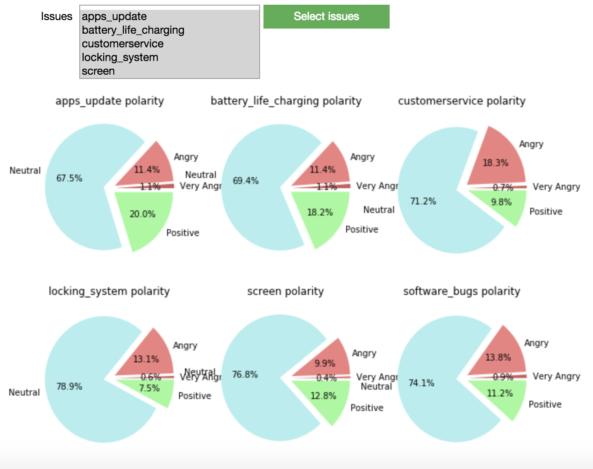
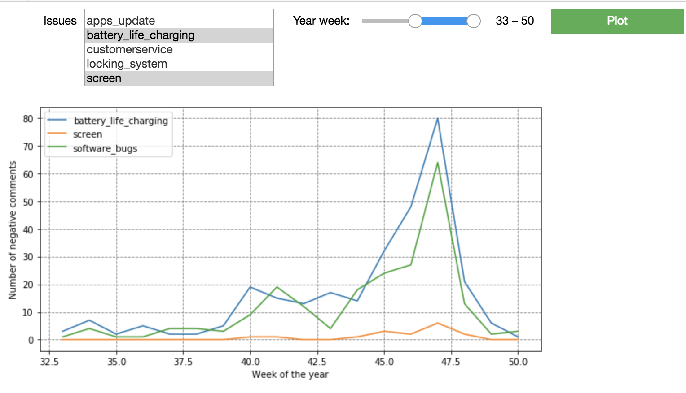

# How-the-internet-talks-about-the-iPhone

**How the internet talks about the iPhone** is a group project carried out with Capgemini's Fast Digital Team. 
Its aim is to identify the most common smartphone defaults shared on social media. The project required web-scraping, feature engineering, data-visualization, natural language processing (bag-of-words model, TF-IDF, graph-of-words model), dimensionality reduction (SVD, t-SNE, NMF), topic-extraction (NMF, LDA, identification of communities in a graph), sentiment analysis, semi-supervised learning (k-nn propagation), classification algorithm (treeboosting) and using libraries such as pandas, matplotlib, bokeh, nltk, scikit-learn, beautifulsoup, selenium, ipywidgets...

We eventually delivered a proof-of-concept by designing dashboard functionnalities embedded in a Jupyter Notebook.
This project was carried out by [Mathilde](https://github.com/mathwild), [Maria](https://github.com/mariafcadena),[Eric](https://github.com/ebgv), [Ruoy](https://github.com/ruoyzhang) and [I](https://github.com/SachaIZADI)

  
  
  

